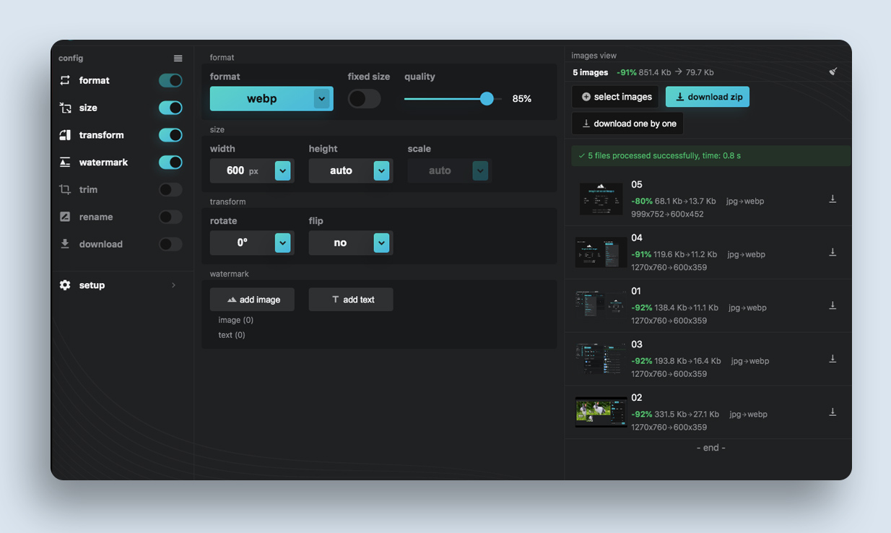
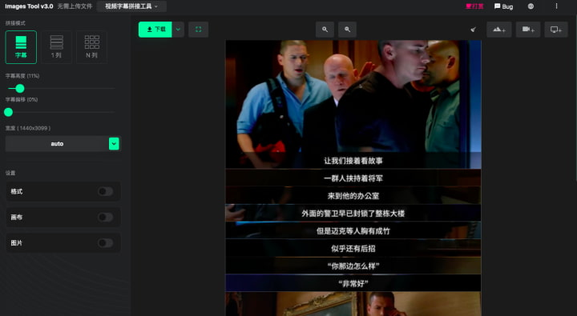

[English](./README.md) | Simplified Chinese | [Japanese](./README_JP.md)

<!--  -->
<h1>FILEDOCR</h1>
<!-- from shields.io/ -->

This toolbox includes image conversion and image stitching, implemented purely on the frontend, ensuring fast speed and privacy protection. It also supports offline use and over 20 languages.

**Q: Why is it named webp2jpg?**  
A: Initially, it was created to convert WebP to JPG, and the name just stuck!

## Online Tool Links
- [Image Conversion](https://eliudistic.github.io/webp2jpg-online-master/index.html)
- [Image Stitching](https://eliudistic.github.io/webp2jpg-online-master/splicing.html)

<h2>
    
    Multi-Functional Image Converter
</h2>

Features:
- [x] Supports converting `psd`, `psb`, `hdr`, `heic`, `heif`, `tiff`, `jpg`, `gif`, `png`, `svg`, `bmp`, `tga` to `jpg`, `webp`, `png`, `gif`, `avif`
- [x] Supports JPG compression (select jpg-tiny)
- [x] Supports PNG compression (png-tiny)
- [x] Supports SVG compression (svg-tiny)
- [x] Supports adding image and text watermarks
- [x] Supports resizing by width, height, or scale
- [x] Supports animated `webp` to `gif` conversion (webp-animation and gif-animation)
- [x] Supports animated watermarks
- [x] Additional features: Base64 output, persistent option data, dark/light UI switch, image rotation and flipping, batch processing (up to 1000 images), and paste-import after a screenshot (Ctrl+V)

 
 

<h2>
    
    Video Subtitle Stitching Tool
</h2>

Have you ever seen images with stitched subtitles from videos? This tool makes it easy to create all forms of such images.

### Workflow:

1. Screen record
2. Generate video
3. Screenshot while playing the video
4. Adjust images
5. Done

### Features:

- [x] Supports screen recording
- [x] Supports importing `mp4` files
- [x] After recording or importing, screenshots can be taken with shortcuts
- [x] Supports cropping and dragging to reorder imported images
- [x] Supports vertical mobile screen
- [x] Supports other common stitching features (single column/row, multiple rows and columns)
- [x] Supports adjusting margins and border styles
- [x] Lossless output with no image blurring
- [x] Supports selecting export formats (`jpg`, `png`, `webp`)

### Tips
- `jpg` maximum size: `65525`
- `webp` maximum size: `16522`
- `png` maximum size: `65525`

## ❤ Thanks

[Technology Enthusiast Weekly #114: USB-based Survival and Uber Jobs](http://www.ruanyifeng.com/blog/2020/07/weekly-issue-114.html)

[Multi-Functional Image Converter: An Online Tool to Batch Convert Images to Various Formats](https://frontendfoc.us/issues/511)

#### [webp2jpg-online-demo](https://github.com/renzhezhilu/webp2jpg-online-demo)

## Developer
This repository is version 3.0 for production use, feel free to use it.

<!-- If you're interested in obtaining the source code and technical details, feel free to join [ohPic](https://github.com/ohPic). -->
